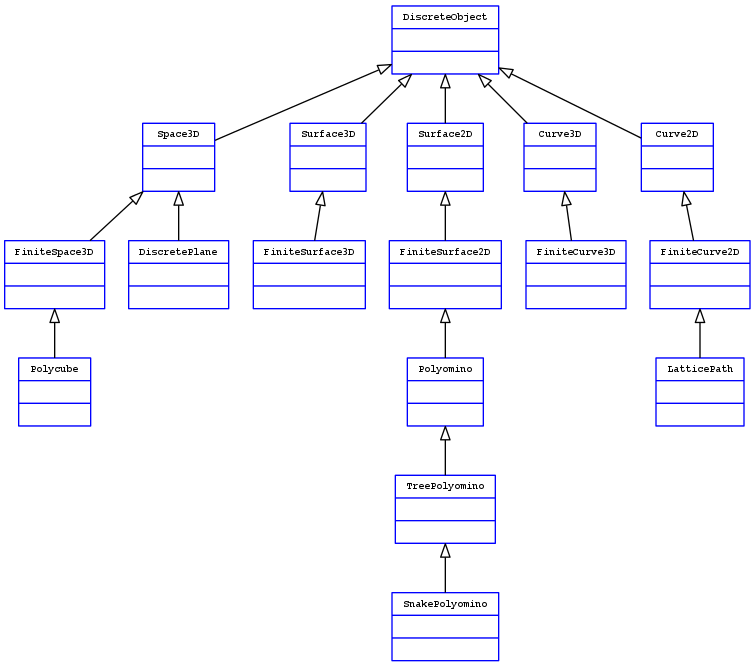

Discrete Geometry in Sage
~~~~~~~~~~~~~~~~~~~~~~~~~

This repository contains material to help design a discrete geometry
library in `Sage <http://sagemath.org>`__

Definitions
===========

A *voxel* is a set of the form :math:`[x_1, x_1 + 1] \times [x_2, x_2 + 1]
\times \ldots [x_n, x_n + 1]`, where

YAUML
=====

A script for generating UML diagrams from
`YAML <http://www.yaml.org/>`__ files has been included.

Dependencies
------------

To run the script, the following softwares are needed :

- Python
- `Graphviz <http://www.graphviz.org/>`__
- `PyYAML <https://bitbucket.org/xi/pyyaml>`__

Usage
-----

See file `diagramme.yaml <diagramme.yaml>`__ to see
an example of YAML syntax to be used for specifying
UML relations.

Then run::

    make

You should obtain the following figure:

.. figure

    UML diagram of classes of the digital geometry library

Currently, only inheritance and meronymy (is-part-of)
relations are supported
